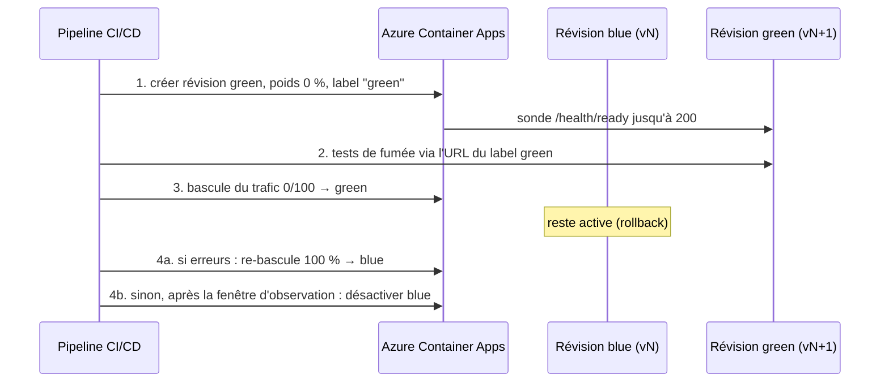

# ADR-0004 — Stratégie de déploiement Blue / Green

**Status :** Accepté
**Date :** 09/10/2026
**Séance :** 2

## Contexte

Chaque nouvelle version (code **ou** modèle) doit arriver en production :

- **sans interruption** du service de prédiction (appelé au moment de la commande) ;
- avec un **retour arrière immédiat** si la nouvelle version se comporte mal ;
- en vérifiant qu'elle est réellement prête **avant** de lui envoyer des clients.

Ce qui existe déjà : la sonde `/health/ready` ne répond 200 que si le modèle est chargé et le stockage joignable ; les versions de modèle sont immuables et sélectionnées par `MODEL_VERSION` (ADR-0002) ; la plateforme Azure Container Apps gère plusieurs révisions et la répartition du trafic ([ADR-0003](ADR-0003-hebergement-plateforme-deploiement.md)).

## Options considérées

| Stratégie | Avantage | Inconvénient pour ce projet |
|---|---|---|
| Big Bang / remplacement direct | Simple | Coupure pendant le redémarrage ; rollback = redéployer l'ancienne version |
| Rolling | Pas de coupure, pas de doublement des ressources | Les deux versions servent des clients en même temps sans contrôle ; rollback lent |
| Canary (10 % → 50 % → 100 %) | Risque limité à une fraction du trafic | Des clients reçoivent des décisions de deux modèles différents pendant des jours ; exige des métriques comparatives (séance 7) |
| Shadow (miroir) | Idéal pour comparer deux modèles sans risque | Double calcul ; nécessite l'historique des prédictions (séance 5) |
| **Blue / Green** | Bascule instantanée de 100 % du trafic, ancienne version gardée allumée, rollback = re-bascule | Deux versions tournent pendant la fenêtre de bascule (coût ×2 temporaire) ; base de données partagée entre les deux |

## Décision

**Blue / Green**, avec les révisions d'Azure Container Apps (mode *multiple revisions*) comme répartiteur de trafic.

Règles :

1. **Une révision = une image + une configuration** (dont `MODEL_VERSION`). Changer de modèle = nouvelle révision, donc même processus que pour du code.
2. La révision green est créée avec **0 % du trafic** ; la sonde de disponibilité d'Azure est branchée sur `/health/ready`, la sonde de vivacité sur `/health`.
3. **Tests de fumée** sur l'URL dédiée au label `green` : `/health/ready` = 200, une prédiction sur les commandes de référence (cellules 37-38 du notebook : `oui` puis `non`).
4. **Bascule** de 100 % du trafic en une opération ; la révision blue reste active.
5. **Critères de rollback** pendant la fenêtre d'observation (30 min) : taux de 5xx > 1 %, latence p95 > 500 ms, ou `/health/ready` ≠ 200. Rollback = remettre 100 % sur blue (quelques secondes, sans redéploiement).
6. Après la fenêtre, blue est désactivée (pas supprimée : réactivable).

## Conséquences

- Deux révisions partagent la même base de commandes : les évolutions de schéma doivent être **rétro-compatibles** (ajouter une colonne, jamais en renommer/supprimer dans la même version) — renforce la nécessité de PostgreSQL en prod (ADR-0003).
- Les compteurs de limitation de débit en mémoire sont propres à chaque révision ; la limite globale est portée par API Management ([ADR-0005](ADR-0005-securite-entrees-sorties.md)).
- Le pipeline CI/CD (à construire) doit automatiser les étapes 1 à 4 ; tant qu'il n'existe pas, elles sont jouées à la main avec `az containerapp revision` / `az containerapp ingress traffic set`.
- Les seuils de rollback supposent des métriques : ils seront branchés sur `/metrics` (séance 7). En attendant, observation manuelle des logs Log Analytics.
- Évolution possible : passer à **Shadow** pour valider un nouveau modèle sur le trafic réel quand l'historique des prédictions existera (séance 5), puis bascule Blue/Green.

Related: [ADR-0003 — Hébergement](ADR-0003-hebergement-plateforme-deploiement.md) · [ADR-0002 — Artefacts du modèle](ADR-0002-stockage-artefacts-modele.md) · [Architecture](../architecture.md)
