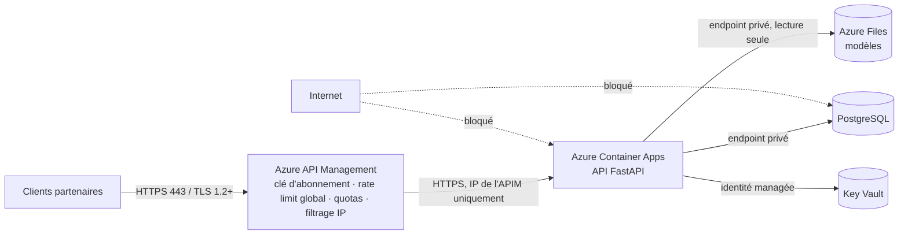

# ADR-0005 — Sécuriser les entrées et sorties de l'infrastructure

**Status :** Accepté
**Date :** 09/10/2026
**Séance :** 2

## Contexte

Une fois sur Azure ([ADR-0003](ADR-0003-hebergement-plateforme-deploiement.md)), l'API devient joignable depuis Internet. Il faut décider **qui peut entrer, par où, à quel débit**, et **vers où** l'application peut sortir.

Risques identifiés :

- appels non autorisés, robots, saturation volontaire (déni de service) ou accidentelle (boucle d'un client) ;
- accès direct à la base de commandes, au stockage du modèle ou au registre d'images en contournant l'API ;
- fuite d'informations techniques (documentation interactive, traces d'erreur, versions de logiciels) ;
- entrées malformées envoyées au modèle.

## Options considérées

| Option | Avantage | Inconvénient |
|---|---|---|
| A. Rien en amont, tout dans l'application | Simple | Le moindre oubli dans le code expose tout ; limite de débit par instance seulement |
| B. Reverse proxy nginx dans un conteneur | Open source, portable | Un composant de plus à exploiter, à mettre à jour, à rendre hautement disponible |
| C. **Azure API Management + réseau privé + défense en profondeur dans l'application** | Passerelle managée : clés d'abonnement, quotas, *rate limiting* global, filtrage IP, journalisation ; les briques de données n'ont aucune exposition publique | Coût et dépendance Azure ; configuration à décrire en code |
| D. Azure Front Door + WAF devant API Management | Pare-feu applicatif (règles OWASP), protection DDoS de niveau 7 | Coût élevé, surdimensionné tant que l'API n'est appelée que par des partenaires connus |

## Décision

**Option C**, l'option D étant gardée comme évolution si l'API devient publique.

### Entrées : un seul point d'entrée

1. **Pare-feu / réseau** : l'environnement Container Apps est placé dans un **VNet** ; son *ingress* n'accepte que l'adresse d'API Management (restriction IP). PostgreSQL, Azure Files, Key Vault et Container Registry sont accessibles par **endpoints privés**, accès public désactivé. Seul le port **443** (HTTPS) est ouvert ; HTTP est redirigé ou refusé.
2. **API Management (API Gateway)** : clé d'abonnement par client, politique `rate-limit-by-key` (**60 requêtes/min par client**), quota journalier, liste blanche d'IP des partenaires, journalisation de chaque appel.
3. **Défense en profondeur dans l'application** (implémentée en séance 2) :
   - clé d'API et rôle vérifiés par l'application elle-même ([ADR-0006](ADR-0006-securite-acces-donnee.md)) ;
   - **limitation du débit** par clé (`SlidingWindowRateLimiter`, fenêtre glissante d'une minute, `RATE_LIMIT_PER_MINUTE`, défaut 60) → **429** `rate_limited` avec en-tête `Retry-After` ;
   - validation stricte des entrées (Pydantic `extra="forbid"`, bornes et énumérations du contrat) → 422 ;
   - erreurs toujours au format `Error`, **sans trace technique** (gestionnaire d'exceptions global) ;
   - documentation interactive (`/docs`, `/redoc`, `/openapi.json`) **désactivée en production** (`EXPOSE_DOCS`, défaut `false` si `APP_ENV=prod`) : on n'expose ni le code ni sa structure ;
   - sondes `/health` et `/health/ready` publiques **pour l'orchestrateur uniquement** (elles ne révèlent ni secret ni donnée).

### Sorties

- L'application n'a besoin de sortir que vers ses dépendances Azure (PostgreSQL, Azure Files, Key Vault, Log Analytics) : flux sortants restreints à ces services via le VNet (groupes de sécurité réseau).
- Les réponses ne contiennent que les champs du contrat OpenAPI (schémas Pydantic en sortie) ; aucune donnée d'une autre commande, aucune information interne.
- Les logs ne contiennent **ni clé d'API ni contenu de secret** (seul le `key_id` est journalisé).

## Conséquences

- Les codes **401, 403 et 429** peuvent être renvoyés par les routes `/v1/*` alors qu'ils ne figurent pas dans `openapi.yml` : écart de contrat **assumé et documenté** ; ils sont volontairement absents du schéma généré pour que `/docs` reste identique au contrat. À proposer à l'intervenant pour une prochaine version du contrat. Le schéma généré déclare en revanche le schéma de sécurité `X-API-Key` (bouton *Authorize* de `/docs`).
- La limite de l'application est **par instance** (mémoire) : elle protège une révision isolée ; la limite **globale** est celle d'API Management. Les requêtes sans clé valide sont rejetées (401) avant le compteur : la protection contre le *brute force* relève de la passerelle.
- En dev, `AUTH_ENABLED=false` et `/docs` sont autorisés ; le démarrage échoue si `APP_ENV=prod` sans authentification (garde-fou dans `Settings`).
- Évolutions : Front Door + WAF si ouverture publique ; audit par un expert en cybersécurité avant la mise en production réelle.

Related: [ADR-0003 — Hébergement](ADR-0003-hebergement-plateforme-deploiement.md) · [ADR-0006 — Accès à la donnée](ADR-0006-securite-acces-donnee.md) · [ADR-0004 — Blue / Green](ADR-0004-strategie-deploiement-blue-green.md) · [Architecture](../architecture.md)
