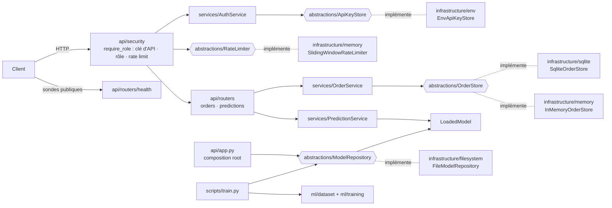
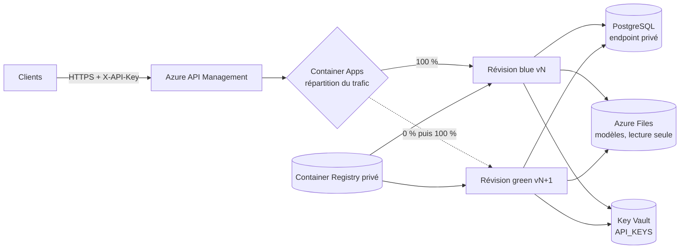

# Architecture de l'application (notebook → API)

Transformation du notebook `project_test_v1_final_final2.ipynb` en application FastAPI respectant le contrat [openapi.yml](../openapi.yml) (opérations `x-session: 1` ; aucune nouvelle opération en séance 2, consacrée au déploiement et à la sécurité).

## Vue d'ensemble



## Arborescence

```text
src/express_delivery/
├── config.py                  # Settings lus depuis l'environnement (dev/test/prod), garde-fous prod
├── domain/                    # Objets métier purs : Order, PredictionResult, ModelMetadata, FEATURE_COLUMNS
│   └── security.py            #   Role, ApiKey, empreinte SHA-256      → ADR-0006
├── abstractions/              # Ports (ABC) : OrderStore, ModelRepository, ApiKeyStore, RateLimiter
├── infrastructure/            # Adaptateurs concrets
│   ├── sqlite/                #   SqliteOrderStore        → ADR-0001
│   ├── memory/                #   InMemoryOrderStore (tests), SlidingWindowRateLimiter → ADR-0005
│   ├── env/                   #   EnvApiKeyStore (API_KEYS, Key Vault en prod) → ADR-0006
│   └── filesystem/            #   FileModelRepository     → ADR-0002
├── ml/                        # Données et entraînement (cellules 8 à 29 du notebook)
├── services/                  # Cas d'usage : OrderService, PredictionService (cellule 34), AuthService
└── api/                       # FastAPI : schémas, erreurs, security (require_role), routes, composition root
scripts/train.py               # Entraîne et publie une version de modèle
scripts/create_api_key.py      # Génère une clé d'API et son entrée API_KEYS (empreinte)
tests/                         # 57 tests dont la vérification du contrat OpenAPI et la sécurité
```

## Correspondance notebook → application

| Cellule(s) | Élément du notebook | Module de l'application |
|---|---|---|
| 3, 5 | Constantes, `ARTIFACTS_DIR`, `MODEL_VERSION` | `config.py` (variables d'environnement) |
| 8 | `generate_orders_dataset` | `ml/dataset.py` |
| 14 | `validate_dataset` | `ml/dataset.py` (règles en table) |
| 18 | `clean_orders_data` | `ml/dataset.py` |
| 20 | `FEATURE_COLUMNS`, `NUMERIC_FEATURES`… | `domain/features.py` |
| 22-29 | Split, pipeline, entraînement, métriques | `ml/training.py` |
| 33-35 | `predict_order_eligibility`, seuil | `services/prediction_service.py` + `POST /v1/predictions` |
| 40 | Tests fonctionnels de prédiction | `tests/test_prediction_service.py`, `tests/test_api.py` |
| 42-44 | Sauvegarde / rechargement joblib | `infrastructure/filesystem/model_repository.py` |
| — | Collecte des commandes | `services/order_service.py` + `POST/GET /v1/orders` |
| 46, 51 | Batch | Séance 5 |
| 48 | Flux temps réel | Séance 5-6 |
| 55 | Model card | Séance 3 (`GET /v1/model`) |
| 12, 31, 54 | Graphiques exploratoires | Non repris (expérimentation, YAGNI) |

## Principes SOLID appliqués

- **S — Responsabilité unique** : une classe = une raison de changer (`SqliteOrderStore` ne fait que persister, `PredictionService` ne fait que prédire, les routes ne font que traduire HTTP ↔ service).
- **O — Ouvert/fermé** : ajouter PostgreSQL, MLflow ou S3 = ajouter une classe dans `infrastructure/`, sans modifier services ni routes.
- **L — Substitution de Liskov** : la même suite `tests/test_order_store.py` tourne sur `InMemoryOrderStore` et `SqliteOrderStore`.
- **I — Ségrégation des interfaces** : deux ports courts et séparés (commandes / modèle) plutôt qu'un « repository » fourre-tout.
- **D — Inversion des dépendances** : services et API dépendent des ABC ; seul `api/app.py` (composition root) instancie les classes concrètes.
- **Sécurité (séance 2)** : la politique d'accès (`Role.USER` sur `/v1/*`, sondes publiques) est déclarée une seule fois dans `create_app` ; les routes ne savent rien de l'authentification (S) ; changer de source de clés ou de limiteur = nouvelle implémentation d'un port (O, D).
- **DRY** : la liste des variables n'existe qu'une fois (`domain/features.py`) ; **YAGNI** : pas de batch, model card ni MLflow avant leur séance.

## Éléments à industrialiser (tableau de la cellule 63)

| Élément | Séance | Solution technique retenue |
|---|---|---|
| Collecte de données | 1 | `POST /v1/orders` → `OrderService` → `SqliteOrderStore` ([ADR-0001](adr/ADR-0001-stockage-commandes-clients.md)) |
| Exposition d'une fonction de prédiction | 1 | FastAPI `POST /v1/predictions`, contrat OpenAPI vérifié par les tests |
| Entraînement du modèle | 1 | `scripts/train.py` (séparé du service) |
| Prédiction à l'aide du modèle | 1 | `PredictionService` + modèle chargé au démarrage via `FileModelRepository` ([ADR-0002](adr/ADR-0002-stockage-artefacts-modele.md)) |
| Environnement (dev → test → prod) | 1 & 3 | Configuration par variables d'environnement (`APP_ENV`, `MODEL_VERSION`, `DATABASE_PATH`, `MODELS_DIR`, `PREDICTION_THRESHOLD`, `AUTH_ENABLED`, `API_KEYS`, `RATE_LIMIT_PER_MINUTE`, `EXPOSE_DOCS`) |
| Plateforme et hébergement | 2 | Azure (France Central), Azure Container Apps ([ADR-0003](adr/ADR-0003-hebergement-plateforme-deploiement.md)) |
| Stratégie de déploiement | 2 | Blue / Green par révisions Container Apps ([ADR-0004](adr/ADR-0004-strategie-deploiement-blue-green.md)) |
| Sécurité des entrées/sorties | 2 | API Management, VNet + endpoints privés, rate limiting applicatif ([ADR-0005](adr/ADR-0005-securite-entrees-sorties.md)) |
| Sécurité de l'accès à la donnée | 2 | Clé d'API + rôles, empreintes dans Key Vault, identité managée ([ADR-0006](adr/ADR-0006-securite-acces-donnee.md)) |

## Architecture cible de production (séance 2)



## Lancer l'application

```bash
pip install -e ".[dev]"
python scripts/train.py --version 1.0.0     # publie artifacts/models/1.0.0
uvicorn express_delivery.main:app --reload  # http://localhost:8000/docs
pytest                                      # 57 tests
```

Related: [ADR-0001](adr/ADR-0001-stockage-commandes-clients.md) · [ADR-0002](adr/ADR-0002-stockage-artefacts-modele.md) · [ADR-0003](adr/ADR-0003-hebergement-plateforme-deploiement.md) · [ADR-0004](adr/ADR-0004-strategie-deploiement-blue-green.md) · [ADR-0005](adr/ADR-0005-securite-entrees-sorties.md) · [ADR-0006](adr/ADR-0006-securite-acces-donnee.md)
